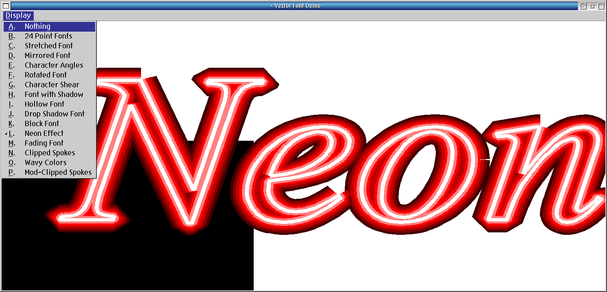

# DEV-SAMPLES-PM-VectFont

PM program demonstrating GPI vector fonts. Charles Petzold PM program demonstrating GPI vector fonts.
From Exploring Vector Fonts with the OS/2 Graphics Programming Interface - Mar 1989 (Vol.4 No.2) (S12219.ZIP)



## LICENSE
* BSD 3 Clauses

## COMPILE TOOLS
* yum install git gcc make libc-devel binutils watcom-wrc watcom-wlink-hll watcom-wcc

## PROJECT LAYOUT
```
src/            - All C and RC source files (lowercase)
bin-gcc/        - GCC/kLIBC build output
bin-wat/        - OpenWatcom build output
doc/            - Screenshots and documentation
makefile.gcc    - GNU make rules for GCC build
makefile.wat    - wmake rules for OpenWatcom build
compile_gcc.cmd - Run the GCC build
compile_wat.cmd - Run the OpenWatcom build
```

## HOW TO COMPILE

**GCC / kLIBC:**
```
compile_gcc.cmd
```
Output: `bin-gcc/vectfont.exe`. Build log: `make_gcc.out`.

**OpenWatcom:**
```
compile_wat.cmd
```
Output: `bin-wat/vectfont.exe`. Build log: `make_wat.out`.

## AUTHORS
* Dave Yeo
* Martin Iturbide
* Charles Petzold

## CHANGE HISTORY
* 1.02 - 2026-09-06 - Sources moved to src/; dual GCC and OpenWatcom build support added (makefile.gcc, makefile.wat, compile_gcc.cmd, compile_wat.cmd); fixed background fill in shadow/neon/spokes/wavy modes (ColorClient now uses GpiBox in page coordinates); fixed PCCH→PCH for Watcom toolkit compatibility; replaced fmin() with min() macro for Watcom C99 compatibility.
* 1.01 - 2023-04-27 - Initial ArcaOS port.

## LINKS
*
